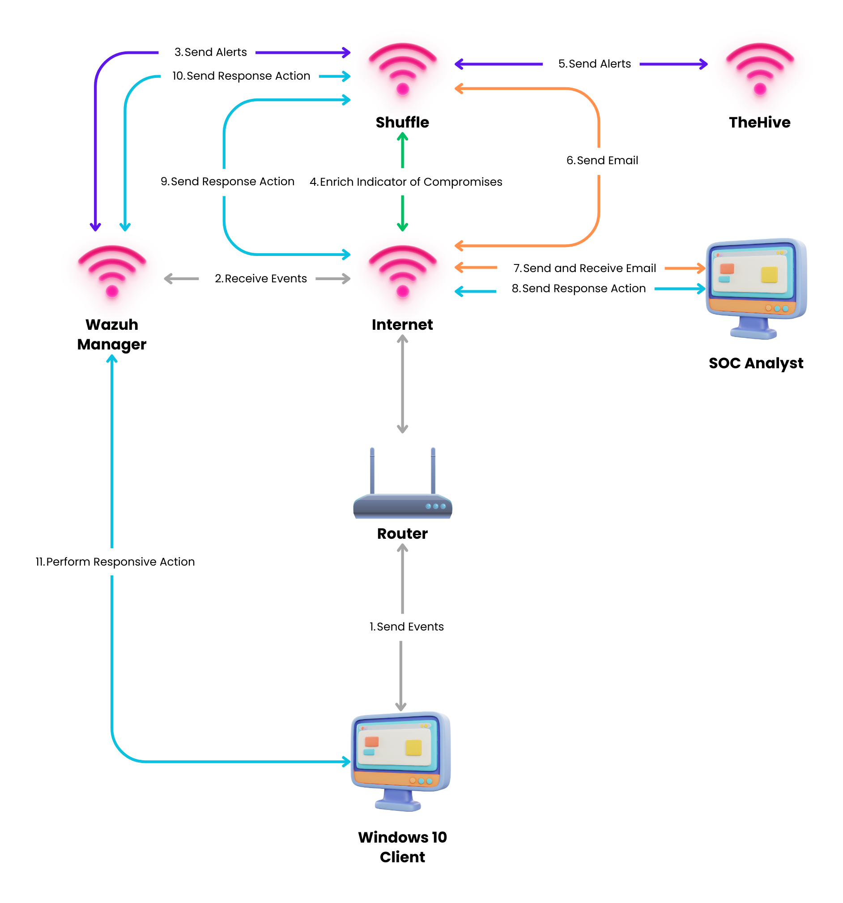
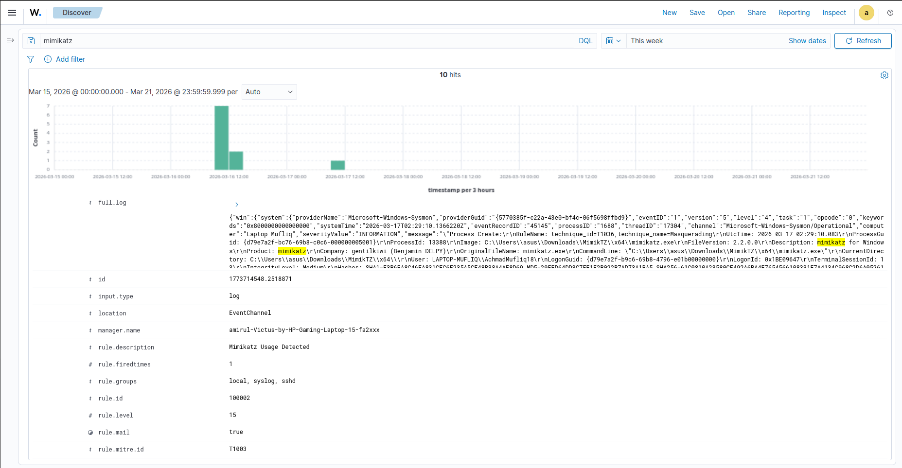
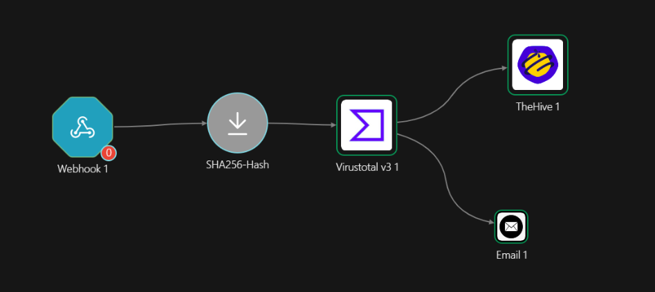
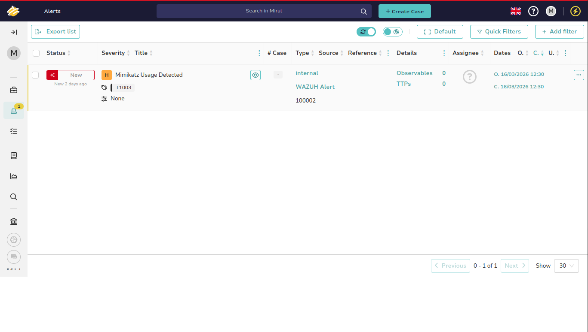
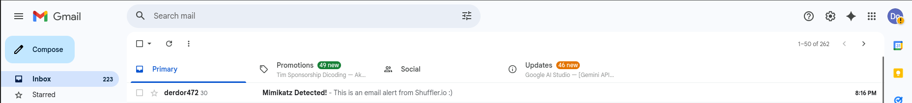

# 🔐 SOC Automation Lab – Mimikatz Detection & Response

This project demonstrates a hands-on implementation of a mini Security Operations Center (SOC) environment designed to detect and respond to credential dumping attacks using Mimikatz.

Unlike theoretical setups, this lab simulates a real attack scenario and shows how security tools can work together to automate detection, enrichment, and incident response.

---

## 🎯 Objective

- Detect credential dumping activity (Mimikatz)
- Automate alert processing using SOAR
- Enrich alerts using threat intelligence
- Generate incident cases automatically
- Notify SOC analyst via email

---

## 🧱 Architecture

---

## ⚙️ Tech Stack

- **Wazuh** → SIEM (Detection & Log Analysis)
- **Sysmon** → Endpoint Telemetry (Windows)
- **Shuffle** → SOAR Automation
- **TheHive** → Incident Response Platform
- **VirusTotal API** → Threat Intelligence
- **Ngrok** → External webhook exposure

---

## 🖥️ Lab Environment

| Component        | Description |
|----------------|------------|
| Windows 10     | Wazuh Agent + Sysmon + Mimikatz |
| Ubuntu Server  | Wazuh Manager + TheHive + Shuffle |

---

## 🔄 Workflow

1. Mimikatz executed on Windows endpoint  
2. Sysmon logs the activity  
3. Wazuh detects suspicious behavior using custom rule  
4. Alert forwarded to Shuffle via webhook  
5. Shuffle extracts SHA256 hash  
6. Hash checked against VirusTotal  
7. If malicious → case created in TheHive  
8. Email notification sent to analyst  

---

## 🚨 Detection Rule

Custom rule created in Wazuh:

- Detects `mimikatz.exe`
- Based on Sysmon event logs
- Mapped to MITRE ATT&CK:
---

## 📊 Results

- ✔ Mimikatz activity successfully detected  
- ✔ Alert enriched with threat intelligence  
- ✔ Incident created automatically in TheHive  
- ✔ Email alert received in real-time  

---

## 📸 Evidence

### Wazuh Alert

### Shuffle Workflow

### TheHive Alert

### Email Alert

---

## 💡 Key Takeaways

- Understanding of SIEM + SOAR integration  
- Hands-on experience with real attack simulation  
- Automated incident response workflow  
- Improved visibility into endpoint behavior  

---

## 🚀 Future Improvements

- Add brute force detection (SSH / Windows)
- Implement active response (block attacker)
- Expand detection use cases

---

## 📌 Author

Built as part of a hands-on cybersecurity learning journey focused on SOC operations and blue team practices.
